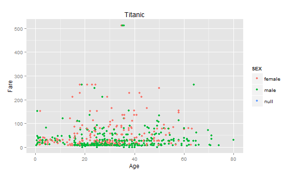
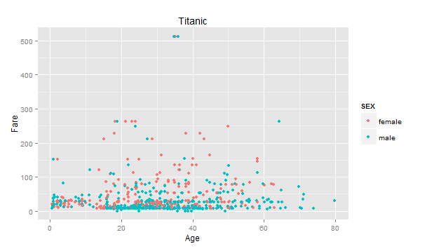
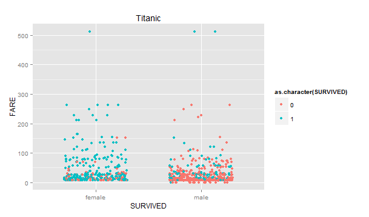
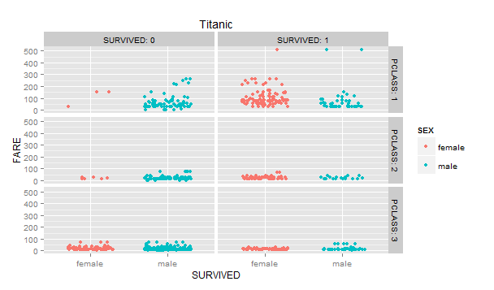
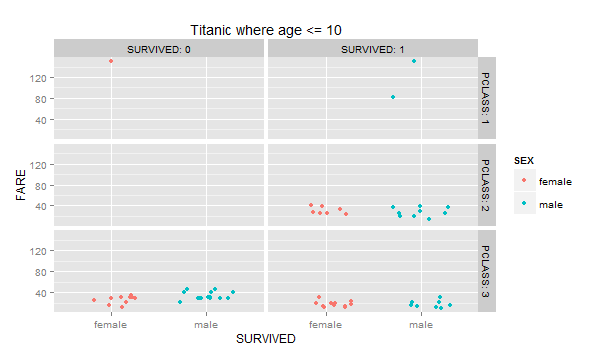
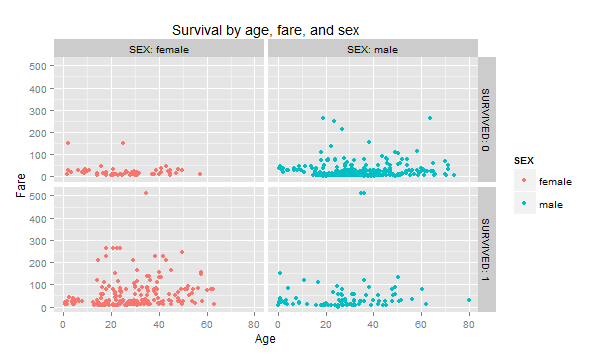

#Titanic

####This is Titanic, our first project in Dr. Cannata's CS 329E Data Visualization class.

####This is how my RStudio is configured:
```{r}
sessionInfo()
```

First we accessed the Oracle database using Dr. Cannata's SQL code and imported the Titanic data into sqldeveloper. Then we imported that into RStudio.

Below, we load a couple of packages to generate the summary and first six values of the data frame.

```{r}
require("jsonlite")
require("RCurl")
# Change the USER and PASS below to be your UTEid
df <- data.frame(fromJSON(getURL(URLencode('129.152.144.84:5001/rest/native/?query="select * from titanic"'),httpheader=c(DB='jdbc:oracle:thin:@129.152.144.84:1521/PDBF15DV.usuniversi01134.oraclecloud.internal', USER='cs329e_vp5467', PASS='orcl_vp5467', MODE='native_mode', MODEL='model', returnDimensions = 'False', returnFor = 'JSON'), verbose = TRUE), ))
summary(df)
head(df)
```

Now that you have seen the data, we will discuss the graphs and associated trends we interpreted from them.


###Graph 1: Age and fare of all data points, including those for which sex is null.



This graph is our first representation of the raw data. There are a couple of data points for which the "sex" field contains null values.


###Graph 2: Age and fare of all data points for which sex is not null.



This next graph takes a subset of the data to filter out unusable values (where sex contains null values). This graph is a visual introduction to the data, displaying male and female passengers ranked by fare and age.


###Graph 3: All passengers for which sex is not null, divided by sex and ranked by fare. Dot color indicates survival.



This next graph shows the survival of the passangers based on sex and fare. Blue points represent those who survived, while red represents passangers who perished. From the graph we can interpret that females were more likely to survive.


###Graph 4: All passengers for which sex is not null, divided by sex, passenger class, and survival and ranked by fare.



This next graph divides the data even further, by subdividing the passengers into passenger classes 1, 2, and 3. We still see that females were more likely to survive; however, this likelihood was increased if the female was a 1st class passenger. Furthermore, 2nd and 3rd class males were at the greatest risk of not surviving.


###Graph 5: All passengers aged 10 and younger for which sex is not null, divided by sex, passenger class, and survival and ranked by fare.



This next graph is the same as Graph 1.4, except that it focuses on passengers aged 10 and younger. Here, we see that all 1st and 2nd class passenger children survived except for one. However, 3rd class passenger children were equally likely as not to survive.


###Graph 6: All passengers for which sex is not null, divided by survival and sex and ordered by fare and age.



The final graph shows the age and fare distribution and survival of male and female passengers. Overall, one can see that males were generally older than females aboard the ship. Survival was least likely for males in the 20-50 age range.